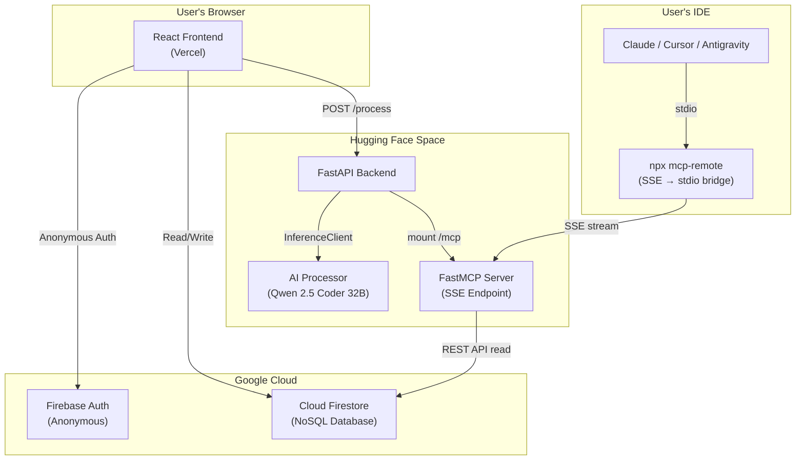

<div align="center">


<br><br>

<pre style="display: inline-block; text-align: left; font-weight: bold; background: none; border: none; padding: 0;">
 __      __  ___  _    _  _   _____ __  __   ___  ___ 
 \ \    / / /   \| |  | || | |_   _||  \/  | / __|| _ \
  \ \  / /  | - || |__| || |__ | |  | \  / || (__ |  _/
   \_/\_/   |_|_| \____/ |____||_|  |_|\/|_| \___||_|  
</pre>

<br>

**Save what you scroll. Use what you saved.**

[](https://vault-mcp-4ssi.vercel.app)
[](LICENSE)
[](https://vault-mcp-4ssi.vercel.app)
[](#)
[](https://kaustubh5934-vaultmcp-backend.hf.space)
[](#)
[](https://antigravity-ide.com)
[](#)

*Built with Google Antigravity · Google Stitch · Firebase · Hugging Face Spaces*

</div>

---

## 🔥 The Problem

You're doom scrolling. A creator shows you a powerful AI tool, a killer prompt, or a useful GitHub repo.

You save it to a bookmark. You forget it forever.

**VaultMCP fixes this** — and takes it one step further. Not only does it save what you find, it **feeds your knowledge directly into your IDE's AI while you code.**

Imagine you're in Cursor, mid-build, and Claude surfaces the exact tool you saved three weeks ago — without you ever leaving your editor. That's VaultMCP.

---

## ✨ What It Does

VaultMCP is an open-source **Agentic Knowledge Base** — a PWA that bridges the gap between passive discovery and active development.

1. **Accepts anything** — URLs, GitHub repos, PDFs, DOCX, XLSX, PPTX, raw text or prompts
2. **Structures it with AI** — Qwen 2.5 Coder 32B extracts title, category, summary, tools, and links
3. **Stores it in the cloud** — Firestore syncs your vault across devices, with offline queue support
4. **Feeds your IDE** — via **Model Context Protocol (MCP)**, Claude / Cursor / Gemini read your vault and recommend your own saved tools *while you're coding*

One chatbox. Paste anything. AI structures it. Saved forever. Used in your IDE.

---

## 🚀 Live Demo

| | |
|---|---|
| 🌐 **App** | [vault-mcp-4ssi.vercel.app](https://vault-mcp-4ssi.vercel.app) |
| ⚙️ **Backend** | [kaustubh5934-vaultmcp-backend.hf.space](https://kaustubh5934-vaultmcp-backend.hf.space) |
| 📦 **GitHub** | [github.com/Kaustubhhbhoirr/VaultMcp](https://github.com/Kaustubhhbhoirr/VaultMcp) |

> ⚠️ **Before trying the demo:** You'll need a free [Hugging Face account](https://huggingface.co) and a Read-permission API token. The onboarding screen will ask for it on first launch.

---

## 🏗️ Architecture



**Saving an entry:**
1. Paste a URL, text, or file in the Chat tab
2. Backend detects input type → scrapes / extracts content
3. Qwen 2.5 Coder 32B returns structured JSON
4. Entry saved to `users/{uid}/vaultItems/{itemId}` in Firestore

**IDE reading your vault:**
1. IDE connects via `npx mcp-remote .../mcp/sse?uid=YOUR_UID`
2. AI calls `get_vault`, `search_vault`, or `compare_project`
3. Your saved knowledge lands in the AI's context window
4. IDE recommends your own saved tools while you build

---

## 🔌 MCP Integration — The Killer Feature

VaultMCP exposes your personal knowledge base to **any MCP-compatible AI coding assistant**.

### Available MCP Tools

| Tool | What it does |
|------|-------------|
| `get_vault` | Returns your full vault as structured Markdown |
| `search_vault` | Searches your vault by keyword |
| `compare_project` | Takes your project README → returns relevant tools from your vault |

### Setup in Claude / Cursor / Gemini

**Step 1:** Open the **Settings** tab in VaultMCP
**Step 2:** Click **`[ COPY MCP CONFIG ]`**
**Step 3:** Paste into your IDE's MCP config:

```json
{
  "mcpServers": {
    "vaultmcp": {
      "command": "npx",
      "args": [
        "-y",
        "mcp-remote",
        "https://kaustubh5934-vaultmcp-backend.hf.space/mcp/sse?uid=YOUR_FIREBASE_UID"
      ]
    }
  }
}
```

> ⚠️ **Keep your Firebase UID private.** It's your vault's access key.

---

## 🧰 Built With

| Tool | Role |
|------|------|
| [Google Antigravity](https://antigravity.dev) | Agentic IDE used to build and iterate the entire project |
| [Google Stitch](https://stitch.withgoogle.com) | UI design and frontend component generation |
| [Firebase](https://firebase.google.com) | Anonymous Auth + Cloud Firestore database |
| [Hugging Face Spaces](https://huggingface.co/spaces) | Free Docker hosting for FastAPI backend |
| [FastMCP](https://github.com/jlowin/fastmcp) | MCP server (SSE endpoint for IDE integration) |
| [Qwen 2.5 Coder 32B](https://huggingface.co/Qwen/Qwen2.5-Coder-32B-Instruct) | LLM for structured JSON extraction |
| [Vercel](https://vercel.com) | Frontend hosting + auto-deploy from GitHub |

---

## 📱 4 Screens

| Screen | Purpose |
|---|---|
| **Onboarding** | One-time setup — display name + Hugging Face token |
| **Chat** | Main screen — paste anything, watch 3-step AI processing live |
| **Vault** | Browse all entries, filter by category, view / download / delete |
| **Settings** | Manage HF token, copy your MCP config, clear vault |

---

## ⚡ Quick Start

### Prerequisites
- Node.js ≥ 18
- Python ≥ 3.10
- [Hugging Face account](https://huggingface.co) + API token (Read permission)
- Firebase project with Firestore + Anonymous Auth enabled

### Frontend
```bash
git clone https://github.com/Kaustubhhbhoirr/VaultMcp
cd VaultMcp/vaultmcp
npm install
npm run dev
```

### Backend
```bash
cd backend
pip install -r requirements.txt
cp .env.example .env
# Fill in HF_TOKEN and FIREBASE_SERVICE_ACCOUNT
uvicorn main:app --reload --port 8000
```

### Environment Variables
```env
# Backend
HF_TOKEN=hf_your_hugging_face_read_token
FIREBASE_SERVICE_ACCOUNT={"type":"service_account","project_id":"..."}

# Frontend
VITE_API_URL=http://localhost:8000
```

---

## 📂 Vault Entry Structure

Every saved item follows this schema:

```md
## [CATEGORY: AI Tools]
### Tool Name
- **Summary:** What it does and why it's useful
- **Tools mentioned:** tool1, tool2
- **Official link:** https://...
- **Source:** https://...
- **Saved on:** 03.JUN.2026
```

**Categories:** `AI Tools` · `Dev Tools` · `Prompts` · `Design` · `Resources` · `Other`

### Slash Commands
Force a category by prefixing your input:
`/ai` · `/dev` · `/prompt` · `/design` · `/resource` · `/other`

---

## 🔌 API Reference

| Method | Path | Auth | Purpose |
|--------|------|------|---------|
| `GET` | `/health` | None | Liveness probe |
| `POST` | `/process` | `X-HF-Token` | Process URL / text through AI pipeline |
| `POST` | `/process/file` | `X-HF-Token` | Process uploaded file (PDF/DOCX/XLSX/PPTX) |
| `GET` | `/.well-known/mcp.json` | None | MCP tool manifest |
| `GET` | `/mcp/sse` | `?uid=` query param | SSE endpoint for MCP clients |

---

## 🔒 Security

```
Browser → Backend (stateless processing) → Firestore (per-user subcollection)
```

- HF token lives **in your browser only** — never written to Firestore
- Firebase Anonymous Auth — no email, no password required
- CORS locked to Vercel domain + localhost
- Backend stores nothing — all persistence is your Firestore

> ⚠️ **Known limitation (v1.0):** MCP SSE reads Firestore via the public REST API without a Firebase ID token. Authenticated reads via Firestore Security Rules are landing in v1.1.

---

## 🗺️ Roadmap

### V1.0 — PWA ✅ (Live)
- [x] Retro Win95 UI — 4 screens
- [x] 7 input types (URL, GitHub, PDF, DOCX, XLSX, PPTX, plain text)
- [x] Qwen 2.5 Coder 32B structuring
- [x] Firestore subcollection + offline queue
- [x] FastMCP SSE server — 3 MCP tools
- [x] MCP config generator in Settings
- [x] Android PWA share target

### V1.1 — Security & Cleanup *(Q3 2026)*
- [ ] Firestore Security Rules (authenticated reads)
- [ ] Rate limiting on `/process`
- [ ] HF Space keep-alive cron
- [ ] Remove legacy dead code

### V2 — Browser Extension *(Q4 2026)*
- [ ] One-click "Save to VaultMCP" from any page
- [ ] Auto-detect tools on the page

### V3 — Native App *(2027)*
- [ ] React Native (iOS + Android)
- [ ] Native share sheet

---

## 🤝 Contributing

Open source. No ads. No monetization. Built for developers by developers.

---

## 👤 Author

**Kaustubh Bhoir** — Computer Engineering

[](https://www.linkedin.com/in/kaustubh-bhoir-ce/)

---

## 📄 License

MIT — use it, fork it, ship it.

---

<div align="center">
<i>"We don't want your data. We don't want your money. We just want you to actually use what you save."</i>
</div>
